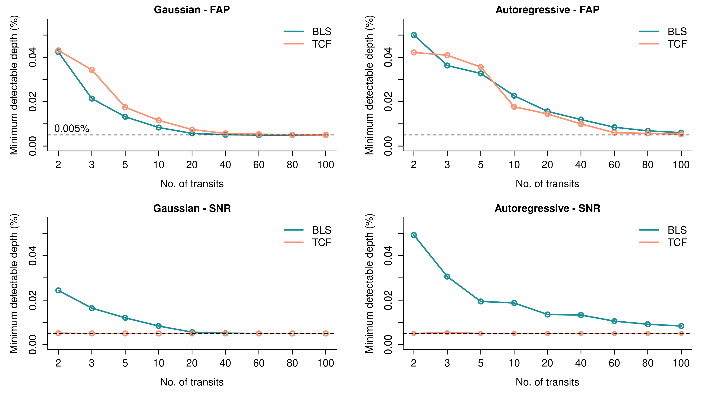

# ARPS - Optimizing future transiting exoplanet surveys

This repository contains R code for comparing the [BLS](https://www.aanda.org/articles/aa/abs/2002/31/aa2422/aa2422.html) and [TCF](https://iopscience.iop.org/article/10.3847/1538-3881/ab26b8) transit periodogram algorithms. It can be extended for comparing any set of periodograms. It uses extreme value theory and/or signal-to-noise ratio (SNR) for comparison.

ARPS stands for Autoregessive Planet Search. This work is an effort made as part of the ARPS project.

**Motivation for this work**\
Small transiting exoplanets are hard to detect via the transit method. The BLS periodogram has been the most popular choice for periodicity search. We want to inspect whether comparing periodograms using statistical approaches can allow us to optimize small transiting exoplanet search in future missions, e.g., [PLATO](https://platomission.com/), by selecting the most appropriate periodogram for a given case. While several variants/alternatives to BLS have been proposed since the BLS paper in 2002, we restrict the comparison between BLS and TCF for simplicity.

## Installation

1. Clone the repository.
2. Create shared object (`.so`) files by compiling the fortran source code:

```bash
# For BLS
cd BLS
gfortran -c eebls.f  # will create eebls.o
gfortran -shared eebls.o

# For TCF
cd ../TCF3.0
gfortran -c median.f90
gfortran -c rand_tools.f95
gfortran -c tcf.f95
gfortran -c main_tcf.f95

# Combine all object files into a single shared object file
gfortran -shared median.o rand_tools.o tcf.o main_tcf.o  # will create a.out
```

3. Edit the shared library paths inside `BLS/bls.R` and `TCF3.0/intf_libtcf.R` (locate the line `dyn.load(...)` at the top of these files) to match the path to the `eebls.so` (for BLS) and `a.out` (for TCF) files.

## Usage

### Simulations

The function `evd` inside `eva_periodogram.R` contains the main functionality for calculating the False Alarm Probability and/or the SNR of periodogram peaks. It can handle both simulated and real observational data. No constraints on the observations, such as evenly spaced, no gaps, etc., are imposed.

Here is a basic example of using this function:

```R
source("eva_periodogram.R")  # To source the R script that contains the evd function.
result <- evd(
    2, 0.01, 2, algo="BLS", noiseType=1, ntransits=10,
    ofac=2, L=300, R=300, FAPSNR_mode=0, lctype="sim"
)
score <- result[1]  # score is the FAP if FAPSNR_mode == 0, SNR if FAPSNR_mode == 1, and a weighted sum of FAP and SNR if FAPSNR_mode == 2.
```

- This simulates a planet with a period = 2 days (first argument), a depth of 0.01% (second argument), and transit duration = 2 hours (third argument).
- `algo` can be either `BLS` or `TCF`.
- `noiseType=1` simulates Gaussian noise with a fixed mean and standard deviation.
    - Currently, the user cannot tune the Gaussian noise parameters via this function interface, but can be done by editing the source code inside `utils.R` - we recommend the user instead manipulate the `depth` argument since only the relative difference between the noise standard deviation and depth matters, and not the actual values.
- `ntransits` controls how many transits must be contained inside the light curve.
- `ofac` is the oversampling factor for computing the periodogram. A value of around 2-5 generally suffices.
- `L` and `R` are parameters used for the extreme value calculation.
- `FAPSNR_mode` controls what metric must be used to get the periodogram score. 0 means only the FAP of the peak is computed. 1 means only the SNR of the peak is computed. 2 means both are computed, in which both FAP and SNR are weighted by fixed factors.
- `lctype` can take values "sim" and "real". The former is to be used for simulations (in which case the period, depth, and duration are needed as input). The latter is to be used for calculations on real light curves (in which case, the observations (i.e., fluxes) and time epochs need to be passed. See below).

### Custom datasets

For passing custom flux values and time epochs (e.g., in the case of real observational data), this can be done by:

```R
result <- evd(y=y, t=t, ...)
```
where `y` and `t` denote the fluxes and time epochs, respectively. Observational fluxes are generally associated with errors, but this cannot be used in the code as of now.

**Important notes**:

1. The BLS code present in this repository (which is extracted directly from the [original source code](https://ui.adsabs.harvard.edu/abs/2016ascl.soft07008K/abstract)), fails when non-finite (e.g., NaN/Inf) values are present in the input. Hence, one needs to manually remove the flux values and the corresponding observation epoch that are non-finite before running the extreme value code above. If you think the extreme value code should handle non-finite value check internally so that one need not do it beforehand, please open an issue, and we can can discuss it further.
2. Noting the above point, [`real_light_curve_application.R`](https://github.com/Yash-10/arps/blob/main/real_light_curve_application.R) contains a code example of how to use the extreme value code for BLS without any errors. See [line 41 in `real_light_curve_application.R`](https://github.com/Yash-10/arps/blob/main/real_light_curve_application.R#L41).

## Example application
The `evd` function can be run on a set of transit depths for different periodogram algorithms independently to yield the minimum detectable depth. These can be used to make plots like the below:



For more details, please see our paper.

## Code motivation
The extreme value part of the code is a replication of the approach described in [Süveges (2014)](https://academic.oup.com/mnras/article/440/3/2099/1077179). This code is not an official implementation of that paper.

## Data availability
Most of our analysis used simulations. The applicability of our method was described on four TESS light curves. These are present as `DTARPS*.txt` files in this repository.

## Bugs or issues
If you find something not working as expected or anything weird, we would like to know and improve it! Please feel free to open an issue in the issue tracker or [send an email](yashgondhalekar567@gmail.com).

## License
[MIT](https://github.com/Yash-10/arps/blob/main/LICENSE)
